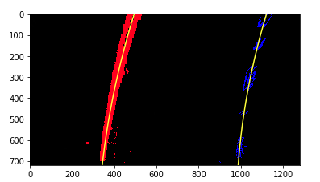

## Advanced Lane Finding

The goals / steps of this project are the following:

1. Compute the camera calibration matrix and distortion coefficients given a set of chessboard images.

2. Apply a distortion correction to raw images.

3. Use color transforms, gradients, etc., to create a thresholded binary image.

4. Apply a perspective transform to rectify binary image ("birds-eye view").

5. Detect lane pixels and fit to find the lane boundary.

6. Determine the curvature of the lane and vehicle position with respect to center.

7. Warp the detected lane boundaries back onto the original image.

8. Output visual display of the lane boundaries and numerical estimation of lane curvature and vehicle position.

All the implemented codes are given in advancedLaneFinding.ipynb file.

## Camera calibration

The code for this step is contained in the function calibration() of the IPython notebook.
I start by preparing "object points", which will be the (x, y, z) coordinates of the chessboard corners in the world. Here I am assuming the chessboard is fixed on the (x, y) plane at z=0, such that the object points are the same for each calibration image. Thus, objp is just a replicated array of coordinates, and objpoints will be appended with a copy of it every time I successfully detect all chessboard corners in a test image. imgpoints will be appended with the (x, y) pixel position of each of the corners in the image plane with each successful chessboard detection. I then used the output objpoints and imgpoints to compute the camera calibration and distortion coefficients using the cv2.calibrateCamera() function. Then, I applied this distortion correction to the test image “output_images/images_with_corners/calibration3.jpg” using the cv2.undistort() function and obtained this result:

## Pipeline(test single image)

## 1. Provide an example of a distortion-corrected image

By using function images_distortion(src, dst, mtx, dist) and parameters mtx and dist, I undistort images
in src folder and save the outputs in dst folder. Then, I take image "straight_lines1.jpg" as example to show result of image distortion correction:

## 2. Create a thresholded binary image

I use color transform HLS and gradient in x-direction to create a thresholded binary image. The detailed codes are given in threshold_image(img, s_thresh=(170,255), sx_thresh=(20, 100)) function. The undistored image "straight_lines1" is taken as example to show thresholded binary image as below:

## 3. Perspective transform

To implement perspective tranform, firstly I calculate transform parameter M and inverse perspective transform parameter Minv. This is done by the function M = cv2.getPerspectiveTransform(src, dst) and function Minv = cv2.getPerspectiveTransform(dst, src). The source and destination points are manually adjusted. Then the warped image is generated by function warped = cv2.warpPerspective(image, M, img_size, flags=cv2.INTER_LINEAR). At last, I take undistored image of image "straight_lines1" as example to show perspective transform.
I verified that my perspective transform was working as expected by drawing the src and dst points onto the test image and its warped counterpart to verify that the lines appear parallel in the warped image.

## 4. Lane-line pixels identification and fitting

Firstly, I take undistort image "test3" as example to get a warped binary image by using the perspective transform parameter, which is shown as below:

With the warped binary image, then I use function find_lane_pixels(binary_warped) with slid windows to detect lane-line pixels. After that, I use function fit_polynomial(binary_warped) to fit the lanes.

To improve the efficiency in video processing, in the next frame of video it is unnecessary to use sliding windows, but instead we can just search in a margin around the previous lane line position. The result is given as below:

## 5. Calculate the radius of curvature of the lane and the position of the vehicle with respect to center

We need to calculate the radius of curvature in real world space rather than based on pixel values. So firstly I define conversions in x and y from pixels space to meters. The detailed codes is given in function measure_curvature_real(leftx, lefty, rightx, righty, ym_per_pix=30/720, xm_per_pix=3.7/700). For the position of the vehicle, I assume the camera is mounted at the center of the car and the deviation of the midpoint of the lane from the center of the image is the offset.

## 6. Display the radius of curvature and offset in example image

I take the same image of "test3" as example to show that the lane area is identified clearly. The detailed codes to display is given in function show_fit_lane_info(offset, radius, image, smooth_number=15, color=(0,255,255)) and function draw_lane_fit(undist, warped ,Minv, left_fitx, right_fitx, ploty). The example result is given as below:

## Pipeline(Video)

Firstly, I define the Line() class to keep track of all the interesting parameters that measure from frame
to frame. Then with function lane_sanity_check(left_fitx, right_fitx, ploty) we can ensure the detected lane lines are real. In class Pipeline(), I use the calibration parameters and perspective parameters the necessary functions I got before to process each frame of the video.
To avoid the jump around from frame to frame, I implement a smooth over the last 15 frames of video to obtain a cleaner result. Each time I get a new high-confidence measurement, I append it to the list of recent measurements and then take an average over 15 past measurements to obtain the lane position that drawn onto the image.

The detailed codes are in video_tracker(), Pipeline() and Line().

The generated new videos is stored under /output_images /outputVideo /

For project_video.mp4 the codes work perfect. However, for other two videos with more complex environment the codes do not work good.

## Discussion

1. The current can only work well on stable and simple video. For video with complex topography or changeable illumination it can not work well.

2. the sanity check function is too simple to handle strongly changed lane curve. 3. The proper look-ahead filter should be applied to improve the efficiency.
